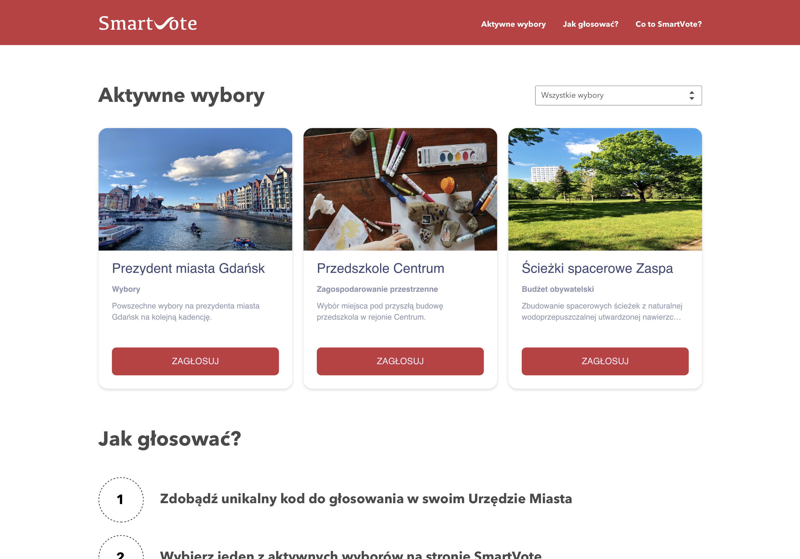

# SmartVote - Voting made Smart




## Project Information

The **SmartVote** project is an intelligent voting platform that replaces traditional voting methods. It gives the user a simple and secure access to vote on things that matter in his community. The project implements BlockChain methods which makes voting secure and minimizes the risk of fraud. The project is based on [scientific research](https://skemman.is/bitstream/1946/31161/1/Research-Paper-BBEVS.pdf).

**SmartVote** is a project that takes part in [Hackathon Wizja Rozwoju `20](https://challengerocket.com/wizjarozwoju20) for smart cities.

## Meet the team

- [Lukasz Zmudzinski](https://zmudzinski.me) - Backend, Frontend, Design, Idea
- [Adam Zybura](https://github.com/GuineaPigGod) - Frontend
- [Sandra Kuczyńska](https://github.com/visse0001) - Backend

# Technical details

## Backend service

### Docker

Install [Docker](https://docs.docker.com/get-docker/)

Start by ensuring that you have Docker and Docker Compose:

```
docker -v
docker-compose -v
```

Move to Backend:
`cd Backend`

Build the new image and spin up the two containers:
`docker-compose up -d --build`

## Website

`Not yet implemented`

## Design guidelines

All UX design files and previews are located in the [Design](https://gitlab.com/lukzmu/smart-vote/-/tree/master/Design) directory.

Assets can be found in the [Design/Assets](https://gitlab.com/lukzmu/smart-vote/-/tree/master/Design/Assets) directory.

### Colors

| **Color** | **Description** |
| :-- | :-- |
| `#D8D8D8` | Accent color |
| `#4A4A4A` | Text and input color |
| `#8E91AC` | Subtitle text color |

### Fonts and Text

Font to use: [Open Sans](https://fonts.google.com/specimen/Open+Sans)

| **Element** | **Style** | **Size** |
| :-- | :-- | :-- |
| `H1` | Bold | 36 px |
| `H3` | Bold | 24 px |
| Regular text | Regular | 14 px |
| Voting box title | Bold | 18 px |
| Voting box subtitle | Bold | 14 px |
| Voting box text | Regular | 12 px |

### Other elements

| **Element** | **Parameter** | **Value** |
| :-- | :-- | :-- |
| General elements | Margin | 20 px |
| Images and Voting box | Corner rounding | 15 px |
| Voting button | Corner rounding | 8 px |
| Voting description circle | Diameter | 80 px |
| Dash | Length | 3 px |

### Image attribution

All photos and images used in the creation of the project were downloaded from [Unsplash](https://unsplash.com/).

> Unsplash grants you an irrevocable, nonexclusive, worldwide copyright license to download, copy, modify, distribute, perform, and use photos from Unsplash for free, including for commercial purposes, without permission from or attributing the photographer or Unsplash. This license does not include the right to compile photos from Unsplash to replicate a similar or competing service.

