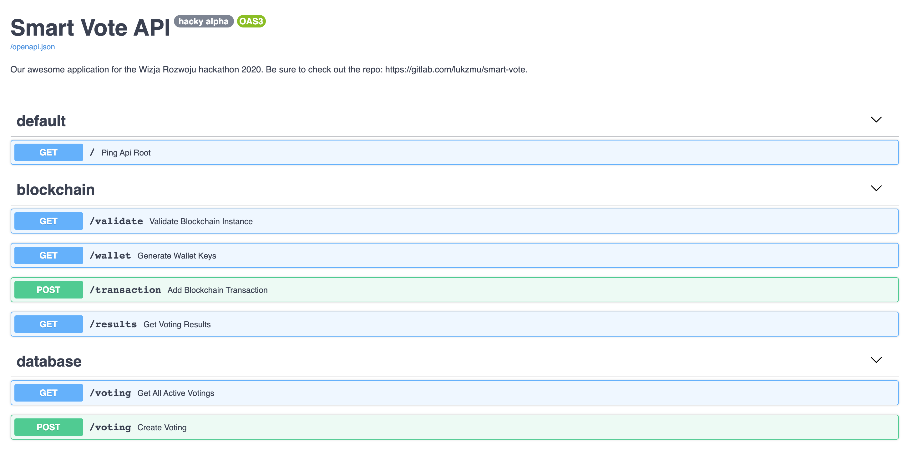

# SmartVote - Voting made Smart


## Project Information

The **SmartVote** project is an intelligent voting platform that replaces traditional voting methods. It gives the user a simple and secure access to vote on things that matter in his community. The project implements BlockChain methods which makes voting secure and minimizes the risk of fraud. The project is based on [scientific research](https://skemman.is/bitstream/1946/31161/1/Research-Paper-BBEVS.pdf).

**SmartVote** is a project that takes part in [Hackathon Wizja Rozwoju `20](https://challengerocket.com/wizjarozwoju20) for smart cities.

## Meet the team

- [Lukasz Zmudzinski](https://zmudzinski.me) - Backend, Frontend, Design, Idea
- [Adam Zybura](https://github.com/GuineaPigGod) - Frontend
- [Sandra Kuczyńska](https://github.com/visse0001) - Backend

# Technical details

## Backend service



### How to run the service on Docker

1. Install [Docker](https://docs.docker.com/get-docker/) and [Docker Compose](https://docs.docker.com/compose/install/).

2. Ensure that you have Docker and Docker Compose:
   ```
   docker -v
   docker-compose -v
   ```

3. Move to Backend directory:
   ```
   cd Backend
   ```

4. Build the image and spin the containers:
   ```
   docker-compose up -d --build
   ```

### FastAPI project structure

The project uses [FastAPI](https://fastapi.tiangolo.com/) to create the API structure. We chose this framework due to simplicity and the speed of prototyping. The FastAPI code is structured as follows:

| **File** | **Description** |
| :-- | :-- |
| `main.py` | Start FastAPI and Blockchain services |
| `schema.py` | The request and response schema for documentation |
| `urls.py` | Declaration of paths and view logic |

### Endpoints

When running the server on your machine, the host is `0.0.0.0:8000`.

| **Endpoint** | **Type** | **Description** |
| :-- | :-- | :-- |
| `/` | `GET` | The root of the API. Can be used to ping the servie. |
| `/validate` | `GET` | Validation of the Blockchain structure. |
| `/wallet` | `GET` | Generate a new wallet for a user. |
| `/transaction` | `POST` | Create a new voting transaction. |
| `/voting` | `GET` | Get all active votings happening in the system. |
| `/voting` | `POST` | Create a new voting with answers. |
| `/results` | `GET` | Preview results for a selected voting. |

### AWS Deploy

The application is hosted on AWS EC2 instance for hackathon purposes:

- `http://ec2-34-244-59-141.eu-west-1.compute.amazonaws.com:8000/docs`

### Alembic commands

- Create migration
   ```
   docker-compose run smart-vote alembic revision --autogenerate -m "Migration"
   ```
- Update database
   ```
   docker-compose run smart-vote alembic upgrade head
   ```

### Blockchain

This project uses a simplified version of a Blockchain. Due to the nature of hackathons, it wasn't possible to implement a fully working version during the event. Things that you need to have in mind when using this project:

- The simplification means that the chain isn't distributed. There is no node checking and updating based on longest chain present on devices.
- There is no user authentication, so you can generate multiple wallets and create multiple voting transactions (even from the same wallet).
- For hackathon presentation purposes, every transaction creates a new block (OMG). This can be turned off, with one line of code, but you know... what happens during a hackathon, stays there.

A short description of *what is what*:

| **File** | **Description** |
| :-- | :-- |
| `blockchain.py` | Contains the main blockchain instance description and functions regarding the creation of bocks, transactions and generally useful things. |
| `block.py` | Contains the Block model class and utility functions. |
| `transaction.py` | Contains the Transaction model class and utility functions. |

The blockchain implementation is based on:

- [Blockchain-Based E-Voting System](https://skemman.is/bitstream/1946/31161/1/Research-Paper-BBEVS.pdf) scientific paper,
- [Blockchain-Enabled E-Voting](https://ieeexplore.ieee.org/abstract/document/8405627) scientific paper,
- [Blockchain-Based E-Voting System](https://ieeexplore.ieee.org/abstract/document/8457919) scientific paper,
- [ngocjr7/voting-blockchain](https://github.com/ngocjr7/voting-blockchain) repository,
- [A Practical Introduction to Blockchain with Python](http://adilmoujahid.com/posts/2018/03/intro-blockchain-bitcoin-python/) blog post.

## Website

The website is built on [React](https://reactjs.org/) using the [npm](https://www.npmjs.com/) package manager. To run the website you need to run the following command in the `Website/smart-vote` directory:

```
npm start
```

If you don't have `npm` or React installed follow [this guide](https://reactjs.org/docs/getting-started.html).

To fully work, the website requires the EC2 instances to be up and running. That might not be the case after the hackathon ends.

## Design guidelines

All UX design files and previews are located in the [Design](https://gitlab.com/lukzmu/smart-vote/-/tree/master/Design) directory.

Assets can be found in the [Design/Assets](https://gitlab.com/lukzmu/smart-vote/-/tree/master/Design/Assets) directory.

### Colors

| **Color** | **Description** |
| :-- | :-- |
| `#B54343` | Accent color |
| `#4A4A4A` | Text and input color |
| `#8E91AC` | Subtitle text color |

### Fonts and Text

Font to use: [Open Sans](https://fonts.google.com/specimen/Open+Sans)

| **Element** | **Style** | **Size** |
| :-- | :-- | :-- |
| `H1` | Bold | 36 px |
| `H3` | Bold | 24 px |
| Regular text | Regular | 14 px |
| Voting box title | Bold | 18 px |
| Voting box subtitle | Bold | 14 px |
| Voting box text | Regular | 12 px |

### Other elements

| **Element** | **Parameter** | **Value** |
| :-- | :-- | :-- |
| General elements | Margin | 20 px |
| Images and Voting box | Corner rounding | 15 px |
| Voting button | Corner rounding | 8 px |
| Voting description circle | Diameter | 80 px |
| Dash | Length | 3 px |

### Image attribution

All photos and images used in the creation of the project were downloaded from [Unsplash](https://unsplash.com/).

> Unsplash grants you an irrevocable, nonexclusive, worldwide copyright license to download, copy, modify, distribute, perform, and use photos from Unsplash for free, including for commercial purposes, without permission from or attributing the photographer or Unsplash. This license does not include the right to compile photos from Unsplash to replicate a similar or competing service.

